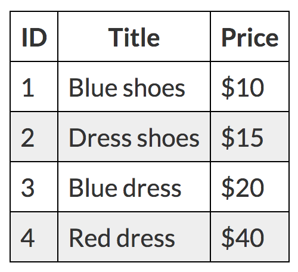
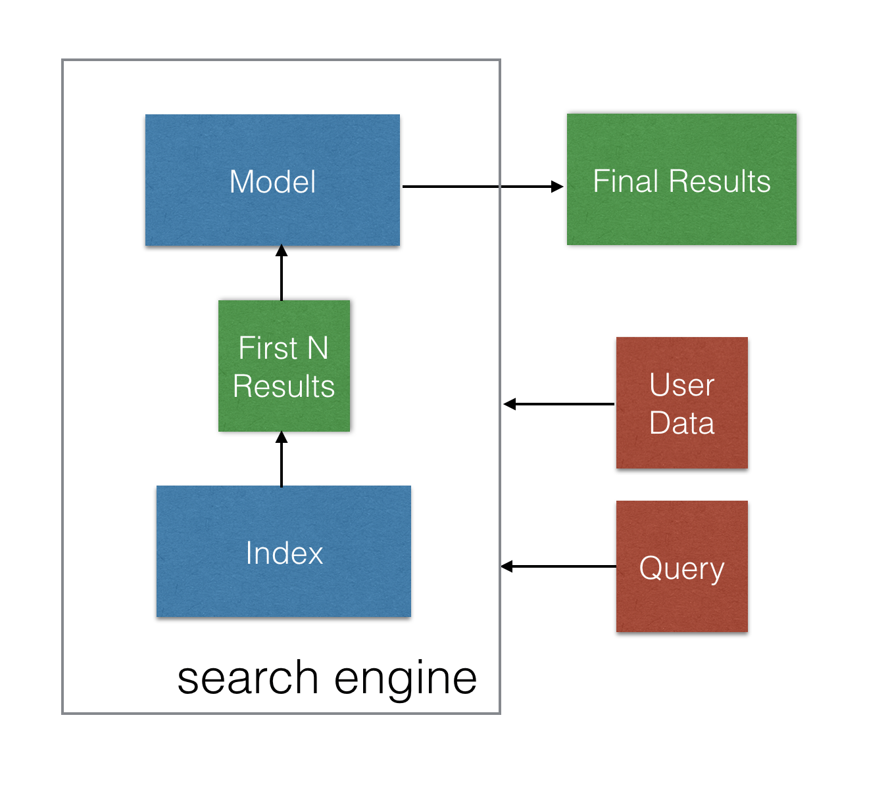
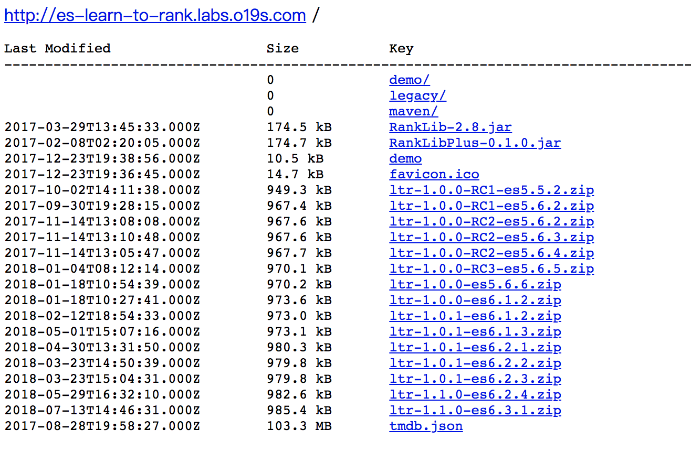
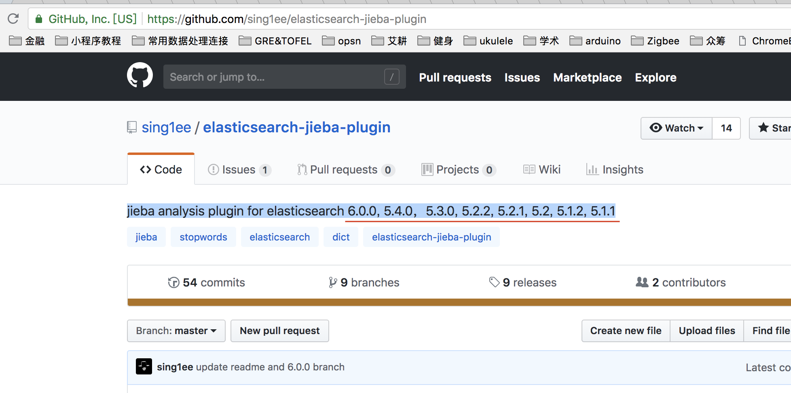

# sltr_demo
这个是o19s提供的[elasticsearch-learning-to-rank](https://github.com/o19s/elasticsearch-learning-to-rank)插件的demo

原版demo中记录了两个feature，这给最后效果的展示带来一定的干扰，因此这里对原版demo稍作修改，以期直观得展示出该插件的效果

注意一下修改源码中的文件路径

## 使用背景
传统的`es`仅仅使用`tokens`作为特征，再结合倒排索引进行排序会有一些天生的局限，比如[以下例子](https://opensourceconnections.com/blog/2017/02/24/what-is-learning-to-rank/)；2中`dress`为形容词，3和4中为名词，两种情况下的使用场景不同，而仅仅使用`tokens`是无法处理这个问题的；因此有将机器学习结合到es中的需求；



## 基本原理
* `LTR`的基本原理：
 `LTR(Learning to Rank)`或`MLR(Machine-Learning Rank)`是机器学习中的一个分支，将排序模型应用于信息检索系统。
* `LTR es`插件的基本原理：
这个插件融合了排序模型（`RankLib(https://sourceforge.net/p/lemur/wiki/RankLib/)`或是`XGBOOST`） 与`Elasticsearch`，排序模型输入打分文件，输出可读格式的模型，训练模型可以通过编程或命令行操作。通过倒排索引返回的文档再经过该模型，即可得到最终的返回结果，如下图；

*  `LTR es`插件的具体实现：
该插件在`es`中具体的实现，本质上是通过`rescoring`将模型得分与原先的`query`得分线性叠加，利用`rescoring`中的`query_weight`以及`rescore_query_weight`可以控制两者的权重，可见[Rescoring](https://www.elastic.co/guide/en/elasticsearch/reference/current/search-request-rescore.html)；

## 插件重要概念
* `feature store`
A feature store corresponds to an independent LTR system: features, feature sets, models backed by a single index and cache. 
通常来说，一个`feature store`对应着一个搜索问题，通常也就对应一个应用，比如`wikipedia`和`wiktionary`分别对应两个不同的`feature store`

* `feature set`
一组feature的组合

* `feature`
Elasticsearch LTR features correspond to Elasticsearch queries. The **score** of an Elasticsearch query, when run using the user’s search terms (and other parameters), are the values you use in your training set . 简单来说，`es`每一条`query`执行后的分数，都可以是`es ltr`的`feature`

## 插件使用流程
1. 创建`feature stoce` `PUT /_ltr`
2. 创建`feature sets` `POST /_ltr/_featureset/movie_features`
3. 进行`feature logging`，即记录每个`feature`的分数
4. 将训练好的`model`嵌入`es` `POST _ltr/_featureset/movie_features/_createmodel`
5. 使用`sltr`语句进行搜索

## 模型测试
* 本地环境搭建：
[es 6.1.2](https://www.elastic.co/downloads/past-releases)+[ltr-1.0.0-es6.1.2.zip](http://es-learn-to-rank.labs.o19s.com/)

* `hpc1`项目存放地址:
`es` `/data/home/li****an/es/elasticsearch-6.1.2`

* 为了能更直观的展示该插件的效果，我对原生`demo`做了修改

## `demo`效果展示
* 目标：利用插件，让原本的结果**颠倒**
* 原搜索结果
以`rambo`作为关键词对`tmdb`数据集进行检索：
```
query = {
  "query": {
      "multi_match": {
          "query": "rambo",
          "fields": ["overview"]
       }
   }
}
```
得到结果为：
```
Rambo III 1370
First Blood 1368
Rambo: First Blood Part II 1369
Rambo 7555
In the Line of Duty: The F.B.I. Murders 31362
Son of Rambow 13258
Spud 61410
```
* 构造标注数据
```
# 将原本非常相关的`7555`对应0，即不相关；
# 将原本不相关的`61410`对应4，即非常相关；
0	qid:1 #	7555	Rambo
1	qid:1 #	1370	Rambo III
1	qid:1 #	1369	Rambo: First Blood Part II
2	qid:1 #	1368	First Blood
3	qid:1 #	31362	In the Line of Duty: The F.B.I. Murders
4	qid:1 #	13258	Son of Rambow
4	qid:1 #	61410	Spud
```
* 将训练好的模型插入`es`后得到检索结果
```
# 原本不相关的`Son of Rambow`现在排在了第一位
Son of Rambow 13258
Spud 61410
In the Line of Duty: The F.B.I. Murders 31362
First Blood 1368
Rambo III 1370
Rambo: First Blood Part II 1369
Rambo 7555
```

## 使用插件所遇到的困难：无法适应`es 6.0.0`版本，该插件无法与现有`jieba`插件兼容同一版本`es`
该插件所适应的`es`版本见下：

`jieba`[插件](https://github.com/sing1ee/elasticsearch-jieba-plugin)所使用的`es`版本见下：


## 坑
### 版本
[python train.py command is throwing error · Issue #123 · o19s/elasticsearch-learning-to-rank · GitHub](https://github.com/o19s/elasticsearch-learning-to-rank/issues/123)

### ranklib
一开始运行`python train.py`时报错，显示`pool-1-thread-1`，跟这个[issue](https://github.com/o19s/elasticsearch-learning-to-rank/issues/166)一样，后来无意间运行竟然成功了

## 最后
`es7.0`之后将要取消对`mapping_types`的支持，估计`o19s`又有的忙了

拥抱开源：）
